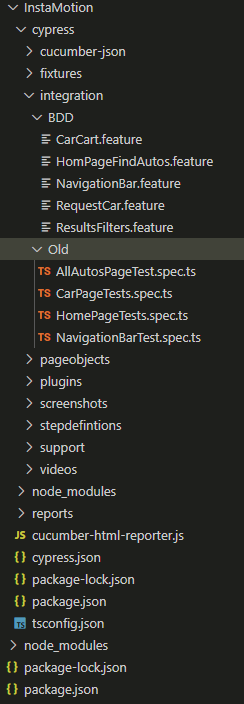
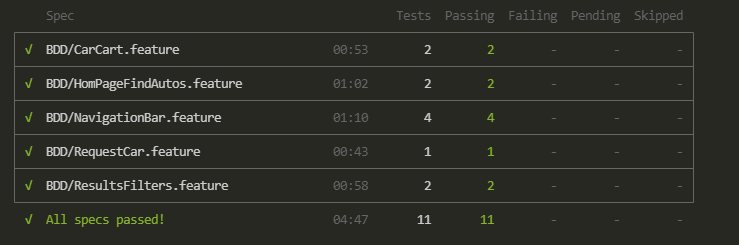
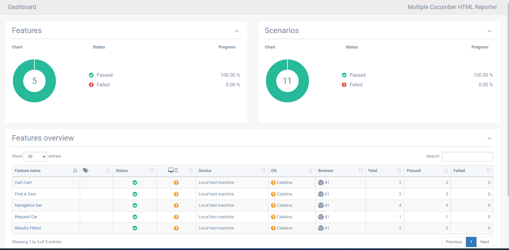

# InstaMotion Website Automation

## About 
###### This Test Automation framework based on CypressIO
###### It use cucumber for BDD as well as .Specs
###### assertion liberray is Chai
###### The Main languagae is TypeScript
###### Based on POM design pattern
###### By Khaled M. Farh, Software Test Automation Engineer
###### E-mail: Khaled.Farh@gmail.com

## Project inside  
###### Cypress - Chai -  Cucumber
###### PageObjects -> ../cypress/Pageobjects
###### StepDefinitions -> ../cypress/Stepdefinitions
###### featuer test files -> ../cypress/integration/BDD
###### old way test files -> ../cypress/integration/Old
###### the project is configured to execute only .feature files

## The Framework Design Patterns
###### This framework used Page Object model to separate the page logic away from the test logic as well as BDD using features file to provide high level abstraction

## The Project Structure 

## The Execution Reports

## How to execute
###### To execute the project -> in the command terminal 
npx cypress run --reporter json --headed
###### After execution to generate a report 
node cucumber-html-reporter.js 
###### your will find the execution report in ../cypress/reports
###### your will find the execution videos in ../cypress/videos

